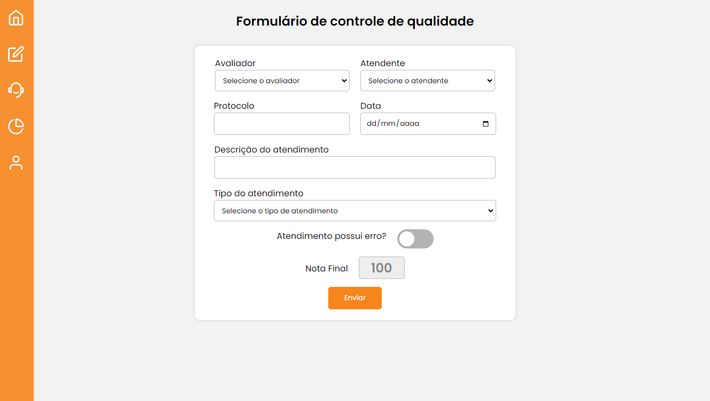

<h1>Sistema de gerenciamento de avaliações - FrontEnd </h1> 

> Status: Developing ⚠️

### Tema projeto: Controle de qualidade de atendimentos 

### Aplicação para avaliação de desempenho de atendimentos

+ 1° Para start o projeto => npm start

---

### Logo do projeto

  

---

### Módulo do formulário de envio de atendimento avaliado sem erro

  

---

### Módulo do formulário de envio de atendimento avaliado com erro

  

---

### Módulo da consulta atendimentos avaliados

  

---

### Módulo da DashBoard

  

---

### Módulo de Usuários

  

